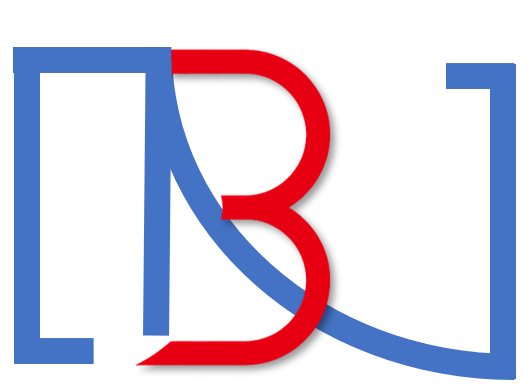

# Digital Life DL-B


🌐 <a href="https://www.bilibili.com/video/BV1rm4y1b7nr" target="_blank">DL-C&部分DL-D演示</a> •🌐 <a href="https://space.bilibili.com/1333712100" target="_blank">AI学社</a> 
## 介绍
本次开源为DL-B，是一个基于[ChatGLM](https://github.com/THUDM/ChatGLM-6B)、[Wav2lip](https://github.com/Rudrabha/Wav2Lip)、[so-vits-svc](https://github.com/justinjohn0306/so-vits-svc-4.0-v2)组建的数字形象方案。代码库在2023年3月中旬编写完毕，之后未进行优化以及更新。

目前本人正在依此项目进行比赛，比赛将于6月下旬进入省赛阶段，目前项目组推进至DL-C的后续优化完善以及DL-D的测试开发。在比赛结束之前不会公开任何关于DL-C以及DL-D的代码以及细节部分，代码以及详细框架将会在比赛结束后经过整理发布更新。忘见谅。

目前代码过于生硬，本人为本科大二学生，学习金融专业，在代码编写方面毫无审美以及技术可言（C+V怪），大佬勿喷。

在比赛结束之后项目将会由**AI学社**接手推进，后续将会制作面向用户友好的框架，全流程懒人包。

## 硬件需求
此处提供DL-B制作是使用的平台作为参考（欢迎提出更低可运行配置作为补充）
| **显卡**   | **CPU** | **内存** | **硬盘**|
| ---------- | ------- | -------- |-------- |
| RTX 3060 12G | Intel i5-12400F | 16 GB | 30G |
      
## 环境安装(整理匆忙，环境包混乱，存在bug感谢提出)
测试环境基于Python 3.9.13 64-bit

使用 pip 安装依赖：`pip install -r requirements.txt`

需要注意，你仍然需要下载一个Python 3.8的[环境包](https://pan.baidu.com/s/1fb8Gao7Bp_alJ8OLKrmtsg?pwd=DLVB)用于So-VITS的运行(点击环境包即可)，不过不用担心，我已经替你配置好了，你只需要下载并解压在DL-B文件夹中，并且保持文件路径
```
DL-B
├───python3.8
   ├───Lib
   ├───libs
   ├───···
   └───Tools

```
除此之外，还需要安装ffmpeg，如果你不想自己手动安装，也可以尝试使用我们提供的[懒人包](https://pan.baidu.com/s/1V1g4_f-irjVJWyTnhLayZA?pwd=DLVB)

## 模型训练
### ChatGLM
ChatGLM拥有很多[微调](https://github.com/liucongg/ChatGLM-Finetuning)方式，用户可以根据自己的实际情况选择合适的微调方式。清华大学官方对于[P-tuning](https://github.com/THUDM/P-tuning-v2)对ChatGLM的微调进行了详尽的[说明](https://github.com/THUDM/ChatGLM-6B/tree/main/ptuning)。在Github上有一个较好的微调示例库，是以[甄嬛为例的微调](https://github.com/piDack/chat_zhenhuan)。此库包含**P-tuning**微调的代码，但并不包含ChatGLM的预训练模型。

程序会由 `transformers` 自动下载模型实现和参数。完整的模型实现可以在 [Hugging Face Hub](https://huggingface.co/THUDM/chatglm-6b)。如果你的网络环境较差，下载模型参数可能会花费较长时间甚至失败。此时可以先将模型下载到本地，然后从本地加载。

从 Hugging Face Hub 下载模型需要先[安装Git LFS](https://docs.github.com/zh/repositories/working-with-files/managing-large-files/installing-git-large-file-storage)，然后运行
```Shell
git clone https://huggingface.co/THUDM/chatglm-6b
```

如果你从 Hugging Face Hub 上下载 checkpoint 的速度较慢，可以只下载模型实现
```Shell
GIT_LFS_SKIP_SMUDGE=1 git clone https://huggingface.co/THUDM/chatglm-6b
```
然后从[这里](https://cloud.tsinghua.edu.cn/d/fb9f16d6dc8f482596c2/)手动下载模型参数文件，并将下载的文件替换到本地的 `module/chatglm-6b` 目录下。

**Optional** 模型的实现仍然处在变动中。如果希望固定使用的模型实现以保证兼容性，可以执行

```Shell
git checkout v0.1.0
```

**使用自己的数据集**

这里提供一个有一点帮助的收集个人语料的[库](https://github.com/Yiyiyimu/QQ-History-Backup)

修改 `train.sh` 和 `evaluate.sh` 中的 `train_file`、`validation_file`和`test_file`为你自己的 JSON 格式数据集路径，并将 `prompt_column` 和 `response_column` 改为 JSON 文件中输入文本和输出文本对应的 KEY。可能还需要增大 `max_source_length` 和 `max_target_length` 来匹配你自己的数据集中的最大输入输出长度。

**对话数据集**

如需要使用多轮对话数据对模型进行微调，可以提供聊天历史，例如以下是一个三轮对话的训练数据：

```json lines
{"prompt": "长城h3风扇不转。继电器好的。保险丝好的传感器新的风扇也新的这是为什么。就是继电器缺一个信号线", "response": "用电脑能读数据流吗？水温多少", "history": []}
{"prompt": "95", "response": "上下水管温差怎么样啊？空气是不是都排干净了呢？", "history": [["长城h3风扇不转。继电器好的。保险丝好的传感器新的风扇也新的这是为什么。就是继电器缺一个信号线", "用电脑能读数据流吗？水温多少"]]}
{"prompt": "是的。上下水管都好的", "response": "那就要检查线路了，一般风扇继电器是由电脑控制吸合的，如果电路存在断路，或者电脑坏了的话会出现继电器不吸合的情况！", "history": [["长城h3风扇不转。继电器好的。保险丝好的传感器新的风扇也新的这是为什么。就是继电器缺一个信号线", "用电脑能读数据流吗？水温多少"], ["95", "上下水管温差怎么样啊？空气是不是都排干净了呢？"]]}
```

训练时需要指定 `--history_column` 为数据中聊天历史的 key（在此例子中是 `history`），将自动把聊天历史拼接。要注意超过输入长度 `max_source_length` 的内容会被截断。

可以参考以下指令：

```shell
bash train_chat.sh
```
当然也可以将多轮对话与单轮对话的语料混杂在一起进行，只需在上面的基础之上直接加入如下模式的对话即可
```json lines
{"prompt":"老刘，你知道那个作业要怎么从电脑上保存到手机上吗？","response":"我也不知道啊","history":[]}
```

---


### so-vits-svc
So-VITS已经是一个很火很成熟的模型了，在B站上也有很多的教学视频，这里就不进行赘述了。这里提供个人认为质量非常高且精髓的[教程](https://www.bilibili.com/video/BV1H24y187Ko)。此库中包含有So-VITS的基础训练以及聚类训练的代码，但是面向用户并不是很友好，而且在3月份制作完毕之后就没有再对DL-B中的内容进行任何改动，此处需要注意此库不包含数据处理以及前期准备的工具。

这里有一些需要补全的模型文件[checkpoint_best_legacy_500.pt](https://ibm.box.com/s/z1wgl1stco8ffooyatzdwsqn2psd9lrr)，放置在`hubert`下
以及两个配套的预训练模型[G_0.pth](https://huggingface.co/justinjohn-03/so-vits-svc-4.0-v2-pretrained/resolve/main/G_0.pth)以及[D_0.pth](https://huggingface.co/justinjohn-03/so-vits-svc-4.0-v2-pretrained/resolve/main/D_0.pth)放置在`.\module\So-VITS`以及`pre_trained_model`文件夹下。

---

### Wav2Lip
这是一个较为古早的方法，在最新的框架中已经做了很多的优化，该版本是基于原始的[Wav2Lip](https://github.com/Rudrabha/Wav2Lip)进行的制作，用户可以自己选择不同的预训练模型权重。此处模型为必须下载项，放置在`.\module\wav2lip`文件夹下。
| **模型**   | **描述** | **链接** |
| ---------- | ------- | -------- |
| Wav2Lip | 高精度的唇同步 | [链接](https://iiitaphyd-my.sharepoint.com/:u:/g/personal/radrabha_m_research_iiit_ac_in/Eb3LEzbfuKlJiR600lQWRxgBIY27JZg80f7V9jtMfbNDaQ?e=TBFBVW) |
| Wav2Lip+GAN |对口型稍差，但视觉质量较好| [链接](https://iiitaphyd-my.sharepoint.com/:u:/g/personal/radrabha_m_research_iiit_ac_in/EdjI7bZlgApMqsVoEUUXpLsBxqXbn5z8VTmoxp55YNDcIA?e=n9ljGW)|
|Expert Discriminator||[链接](https://iiitaphyd-my.sharepoint.com/:u:/g/personal/radrabha_m_research_iiit_ac_in/EQRvmiZg-HRAjvI6zqN9eTEBP74KefynCwPWVmF57l-AYA?e=ZRPHKP)|
|Visual Quality Discriminator||[链接](https://iiitaphyd-my.sharepoint.com/:u:/g/personal/radrabha_m_research_iiit_ac_in/EQVqH88dTm1HjlK11eNba5gBbn15WMS0B0EZbDBttqrqkg?e=ic0ljo)|

需要注意，此库需要采集部分视频，可以使用手机、电脑或者相机进行录制，用于采集人面部信息，建议格式为`.mp4`，分辨率为`720p`或`480p`，单个视频时常为5-10s为妙，可以采集多个视频。将视频文件存放在`source`文件夹下。

关于Wan2lip的优化，在B站上也有许多大佬已经做出来了，也就不进行赘述了（lazy），这里提供一个[视频](https://www.bilibili.com/video/BV1g8411T7it)

注意，除上述内容，还需要下载一个在推理过程中需要用到的模型[s3fd.pth](https://pan.baidu.com/s/1V4suCAbly7038xfGcFqO7Q?pwd=DLVB)放置在`.\face_detection\detection\sfd`文件夹下

---

### 源码更改
**此库中不包含任何模型！！直接拉取后无法使用！！必须要训练模型**

源码一共在如下几处需要进行更改

---
将所有微调好之后的模型放入`module`中的相应文件夹下。请将**P-tuning**训练完后输出至`output`中的所有文件复制到本地对应的`output`中。`So-VITS/44k`下用于存放So-VITS的训练模型。`wav2lip`文件夹下为以存放好的wav2lip+GAN模型。

---

在`main_demo.py`的第32行中`CHECKPOINT_PATH`更改为个人微调之后的模型
```python
prefix_state_dict = torch.load(os.path.join(CHECKPOINT_PATH, "pytorch_model.bin"))
```
注意你可能需要将 `pre_seq_len` 改成你训练时的实际值。如果你是[从本地加载模型](https://github.com/THUDM/ChatGLM-6B#%E4%BB%8E%E6%9C%AC%E5%9C%B0%E5%8A%A0%E8%BD%BD%E6%A8%A1%E5%9E%8B)的话，需要将 `THUDM/chatglm-6b` 改成本地的模型路径（注意不是checkpoint路径）。

源码中默认的写法为加载的是新 Checkpoint（只包含 PrefixEncoder 参数）

如果需要加载的是旧 Checkpoint（包含 ChatGLM-6B 以及 PrefixEncoder 参数），或者进行的是全参数微调，则直接加载整个 Checkpoint：

```python
model = AutoModel.from_pretrained(CHECKPOINT_PATH, trust_remote_code=True)
```

---
在`So-VITS_run.py`中加入模型路径以及说话人名称（取决于你训练时的设置）
```python
 parser.add_argument('-m', '--model_path', type=str, default="", help='模型路径')
parser.add_argument('-s', '--spk_list', type=str, nargs='+', default=[''], help='合成目标说话人名称')
```
---
需要对`wav2lip_run.py`下:
```python
#VIDEO
face_dir = "./source/"
```
进行更改，此处调用的为前面录制好的视频，可以自行编写视频选择方案。

---
不出意外，最后直接在VScode或者其他的软件中运行`main_demo.py`即可。祝大家玩的开心。

## 协议

本仓库的代码依照 [GNU GPLv3](LICENSE) 协议开源。各模型的权重使用则需遵循其开源时的协议。
